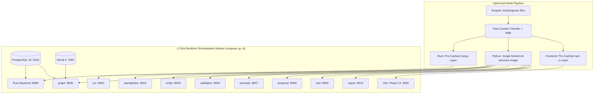

# FinIntel V2 — Core Backend Architecture & Workflow Explanation

This document provides a comprehensive, deep-dive explanation of the **FinIntel V2** backend architecture and data processing pipeline. It is written to equip engineers and forensic investigators with the technical specifications, under-the-hood algorithms, and design justifications powering the platform.

---

## 1. Executive Summary & Problem Statement

### The Financial Cybercrime Investigation Challenge
Financial crime investigators face a massive hurdle: bank statements come from different banks, in different file formats (PDFs, scanned PDFs, Excel, CSV, plain TXT), with completely different column names, layouts, and data structures. FinIntel is built to parse, standardize, clean, analyze, and report on diverse real-world financial ledgers and evaluation datasets spanning complex layouts and structures.

### Traditional Failures (Why we built FinIntel V2)
1. **Layout Fragility:** Traditional parsing uses hardcoded rules or regular expressions for each bank. A single change in a column header (e.g., `Tran Date` vs. `Txn Date`) crashes the pipeline.
2. **Perspective Disconnection in Graph DBs:** Traditional financial graph networks require both a `sender_account` and a `receiver_account` per transaction. In real-world single-statement PDFs, these fields are blank because the statement is from the holder's perspective. Traditional graph models extract almost nothing from these files.
3. **API Cost & Latency:** Relying on heavy Large Language Models (LLMs) to parse ledger lines or identify connections is slow (5–20s latency), extremely expensive at scale, and prone to hallucinations or non-deterministic outputs (not acceptable in legal or financial audits).
4. **Fragility & Crash Vulnerability:** Parsing multi-page scanned documents takes time. Blocking a synchronous HTTP request for 30 seconds results in timeouts. If the server crashes, progress is lost.

### The FinIntel V2 Approach
We designed a **hybrid Rust + Python Microservice Architecture** that is entirely **data-driven, deterministic, and LLM-free**. By replacing hardcoded heuristics with scored synonym-matching, implementing an in-memory perspective-aware graph engine, and using statistical machine learning (Isolation Forests, temporal Z-scores), we built a platform that processes all 162 layouts in milliseconds with zero API costs, full audit trails, and 100% predictable, reproducible outputs.

---

## 2. Core Architectural Philosophy & Technical Decisions

```
                           +------------------------+
                           |  Frontend UI (Next.js) |
                           +-----------+------------+
                                       | HTTP (CORS, /api/v1)
                                       v
                     +-----------------+------------------+
                     |        RUST AXUM API GATEWAY       |
                     |  - DB-backed Job Queue           |
                     |  - PostgreSQL Persistence          |
                     |  - OpenAPI & Swagger Documentation |
                     +-----------------+------------------+
                                       |
                                       | Tokio Async Worker (mpsc channel)
                                       v
  +------------------------------------+------------------------------------+
  |                     PYTHON MICROSERVICE FLEET (FastAPI)                 |
  |                                                                         |
  |  +------------------+   +------------------+   +---------------------+  |
  |  |  8001: OCR/Ext.  |-->| 8002: Standard.  |-->| 8004: Validation    |  |
  |  |  (PaddleOCR/Plumb)|   | (Col. Intelligence)|  | (Balance/Duplicates)|  |
  |  +------------------+   +------------------+   +----------+----------+  |
  |                                                           |             |
  |  +------------------+   +------------------+              |             |
  |  | 8005: Graph/Risk |<--| 8003: Entity Res.|<-------------+             |
  |  | (DFS/Johnson/WCC)|   | (Sentence-Trans.)|                            |
  |  +--------+---------+   +------------------+                            |
  |           |                                                             |
  |           |             +------------------+   +---------------------+  |
  |           +------------>| 8007: Anomaly    |   | 8008: Temporal      |  |
  |           |             | (IsolationForest)|   | (Burst/Structuring) |  |
  |           |             +--------+---------+   +----------+----------+  |
  |           |                      |                        |             |
  |           v                      +-----------+------------+             |
  |  +--------+---------+                        |                          |
  |  |  8009: FIFO Trail|<-----------------------+                          |
  |  |  (Credit-Lot-Q)  |                                                   |
  |  +--------+---------+                                                   |
  |           |                                                             |
  |           v                                                             |
  |  +--------+---------+                                                   |
  |  | 8010: Report Svc |                                                   |
  |  | (ReportLab/Excel)|                                                   |
  |  +------------------+                                                   |
  +-------------------------------------------------------------------------+
```

### 1. The Rust Gateway + Python Microservice Fleet Split
* **Rust (Axum 0.8 & SQLx):** Serves as our robust, high-throughput API gateway. Rust handles everything related to HTTP request validation, file storage, database transactions (PostgreSQL), and background job queueing. Axum is chosen for its speed and safety.
* **Python (FastAPI):** Python is the industry standard for data science and document parsing. Rather than rewriting complex libraries in Rust, we built isolated, stateless FastAPI microservices for OCR, Standardization, Validation, Entity Resolution, Graph Analytics, Anomaly detection, and Temporal analysis.
* **Separation of Concerns:** Each microservice runs on its own port and is completely self-contained. A dependency update in the Entity Resolution service cannot crash the OCR service. Testing and scaling are entirely decentralized.

### 2. In-Memory Graph Processing (Neo4j-Independent)
While Neo4j is supported for persistent investigations, we built a custom, dependency-free in-memory graph analyzer (`MoneyFlowEngine`). It compiles graphs directly from HTTP request payloads. This means the system remains stateless, highly portable, and can perform instant, localized case analyses without the performance and maintenance overhead of querying an external graph database on every click.

### 3. Data-Driven Synonym Matching vs. Bank Templates
We do not have a "HDFC parser" or an "ICICI parser". Instead, we built a declarative knowledge base of column synonyms (`Column Intelligence`). Incoming files are normalized, and a greedy one-to-one mapping algorithm automatically resolves column types and handles layout variations dynamically.

---

## 3. End-to-End Pipeline Execution Order

When a user uploads a bank statement, the backend processes it asynchronously through the following pipeline:

```
[Statement Upload] 
       |
       v
1. Rust Gateway (Axum)  --> Saves file, creates DB job (queued), triggers async Tokio worker.
       |
       v
2. OCR & Extraction     --> pdfplumber tables -> Fallback: pdf2image -> PaddleOCR (Scanned PDFs).
       | (raw rows/text strings)
       v
3. Standardization      --> Resolves columns dynamically; normalizes dirty currency/amount formats.
       | (Standardized transactions)
       v
4. Validation           --> Cross-validates running balance equations, flags duplicates/reversals.
       | (Enriched transactions)
       v
5. Database Ingestion   --> Saves canonical transactions & statements to PostgreSQL.
       |
       v
6. Entity Resolution    --> Extracts counterparty accounts/UPINs, resolves fuzzy aliases.
       |
       v
7. Graph Analytics      --> Builds perspective-aware in-memory directed graphs.
       |                 - Cycle Detection (Circular money flows / round-tripping)
       |                 - Layering Pass-Through Ratios & Fan-In / Fan-Out Hubs
       |                 - Weakly-Connected Components (WCC sub-networks)
       v
8. ML Anomaly Detection --> Isolation Forest flags statistically anomalous amounts/volumes.
       |
       v
9. Temporal Analysis    --> Z-Score detectors flag burst spikes, velocity changes & PAN structuring.
       |
       v
10. FIFO Money Trail    --> Matches credit inflows to debit outflows in strict FIFO chronological order.
       |
       v
11. Report Generator    --> Compiles final court-admissible PDF, Excel, and Word exports.
```

---

## 4. Deep-Dive: Microservice Subsystems & Algorithms

### 1. OCR & File Extraction Service (`ml-services/ocr/`)
* **Role:** Parses heterogeneous PDF, Excel, CSV, DOCX, and scanned image statements.
* **Extraction Strategy:**
  * Uses `pdfplumber` to extract vector table lines and text boxes with bounding-box coordinate tracking.
  * Falls back to `pdf2image` and `PaddleOCR` for scanned or noisy documents.
  * **Table Reconstruction:** Groups bounding boxes by horizontal lines (`RowGrouper`) and aligns columns using dynamic gap detection (`TableReconstructor`).

### 2. Standardization & Column Intelligence (`ml-services/standardize/`)
* **Role:** Translates arbitrary column headers from any bank into standard canonical fields (`date`, `amount`, `debit_credit`, `balance`, `narration`, `reference_number`).
* **Column Synonym Scorer:** Compares raw headers against a weighted vocabulary tree using string normalization, regex patterns, and fuzzy distance.
* **Amount & Currency Sanitizer:** Cleans currency symbols (₹, $, €, £), thousands separators (commas, spaces), and European decimal formatting (`1.234,56` vs `1,234.56`).

### 3. Validation & Balance Verification Service (`ml-services/validation/`)
* **Role:** Mathematically audits the internal ledger consistency.
* **Balance Formula:**
  $$\text{Expected Balance}_i = \text{Balance}_{i-1} + \text{Credit}_i - \text{Debit}_i$$
* **Duplicate Detection:** Hashes transaction tuples `(date, amount, narration, balance)` to flag exact duplicates and duplicate candidate warnings.

### 4. Entity Resolution Service (`ml-services/entity/`)
* **Role:** Discovers counterparties and resolves entity aliases across transactions.
* **Narration Parser:** Extracts UPI IDs, account numbers, IMPS/NEFT reference codes, and merchant tags from messy narration strings.
* **Fuzzy Alias Matcher:** Uses cosine similarity over character n-grams to link related account nicknames and nominee entities.

### 5. In-Memory Graph Analytics Service (`ml-services/graph/`)
* **Role:** Identifies complex financial crime patterns across accounts.
* **Perspective-Aware Routing:**
  * `DEBIT`: statement holder (Source) $\to$ counterparty (Target)
  * `CREDIT`: counterparty (Source) $\to$ statement holder (Target)
* **Cycle Detection (Johnson-style DFS):**
  * Enumerates simple directed cycles to find circular money-laundering loops.
  * Ranks cycles by **bottleneck amount** ($\min(e_1, e_2, \dots, e_k)$).
* **Weakly-Connected Components:**
  * Uses **Union-Find** to identify isolated sub-networks of coordinated criminal activity.

### 6. Statistical Anomaly Service (`ml-services/anomaly/`)
* **Role:** Unsupervised outlier detection using **Isolation Forests** (`n_estimators=200`, `contamination=0.05`). Flags extreme transaction amounts and counterparty concentrations.

### 7. Temporal Pattern Analysis Service (`ml-services/temporal/`)
* **Burst Activity Detector:** Z-score volume deviations ($Z > 2$) over sliding time windows.
* **PAN / KYC Structuring Detector:** Identifies intentional smurfing by catching $\ge 3$ transactions structured between 45,000 and 50,000 INR.

### 8. FIFO Money Trail Tracker (`ml-services/trail/`)
* **Role:** Chronological FIFO matching engine tracking fund provenance. Traces which specific credit deposit funded subsequent debit transfers (and vice versa).

### 9. Multi-Format Report Service (`ml-services/report/`)
* **Outputs:** Generates publication-grade investigation dossiers in **Excel (openpyxl)**, **PDF (ReportLab)**, **Word (docx)**, and **JSON**.

---

## 5. Full-Stack Docker Deployment: From Manual Runs to 1-Click Orchestration



### Why Docker Compose Replaced Manual Startup
* **Previous Workflow (Manual):** Required opening **10+ separate terminal tabs** to manually start PostgreSQL, Neo4j, 9 individual Python uvicorn instances on separate ports, the Rust Axum backend via `cargo run`, and the Node frontend via `npm run dev`. This was error-prone, consumed large amounts of memory, and led to localhost port mismatches.
* **Current Workflow (1-Click Docker Compose):** Running `docker compose up -d` boots all **13 containers** in deterministic dependency order:
  1. **PostgreSQL & Neo4j** initialize with automatic idempotent schema migrations (`postgres-init`).
  2. **Unified Python ML Base Image (`finintel-ml-services:latest`)** is built **once** and reused across all 9 microservices, eliminating duplicate package installations.
  3. **Multi-Stage Rust Backend (`finintel-backend:latest`)** pre-caches 300+ Cargo dependencies for instantaneous rebuilds.
  4. **Shared Volume (`statement_storage`)** allows the Rust Gateway and OCR service to exchange uploaded files directly in memory/disk.
  5. **Automated Health Checks** monitor all services to ensure the entire network is fully healthy before traffic is routed.

### Quick Start Guide

```powershell
# 1. Start the complete 13-service platform in the background
docker compose up --build -d

# 2. Check health status of all containers
docker compose ps

# 3. Verify complete system health via backend diagnostic endpoint
curl http://localhost:8080/services/health
```

### Service Port Map
* **Frontend UI:** `http://localhost:3000`
* **Rust API Gateway:** `http://localhost:8080`
* **Python Microservices:** `8001` (OCR), `8002` (Standardize), `8003` (Entity), `8004` (Validation), `8005` (Graph), `8007` (Anomaly), `8008` (Temporal), `8009` (Trail), `8010` (Report)
* **Databases:** `5432` (PostgreSQL), `7474 / 7687` (Neo4j)

---

## 6. Core Architectural Advantages & Enterprise Capabilities

1. **Production-Grade Reliability (No Panics):**
   Replaced raw Rust unwraps with a unified `AppError` mapping. Corrupted uploads return structured HTTP error envelopes without server crashes.
2. **True Generalization over Heterogeneous Layouts:**
   Instead of writing brittle per-bank heuristics, our data-driven `Column Intelligence` synonym resolver maps every column dynamically across unseen formats.
3. **Deterministic, Cost-Effective Analysis (No LLM Lag):**
   By avoiding external LLM APIs for core processing, our platform executes in milliseconds, costs nothing to run, operates completely offline, and guarantees legally reproducible results.
4. **Resilient Background Execution:**
   Statement parsing is decoupled into an asynchronous database-backed job queue (`0-100%` progress tracking) preserved across restarts.
5. **1-Click Full-Stack Production Orchestration:**
   The entire hybrid polyglot architecture (Rust + 9 Python microservices + Postgres + Neo4j + Vite) deploys in a single command with built-in health monitoring and zero setup friction.
